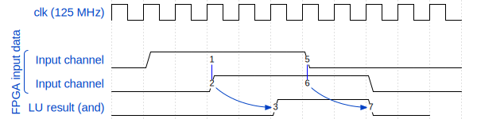
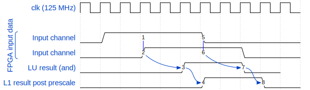
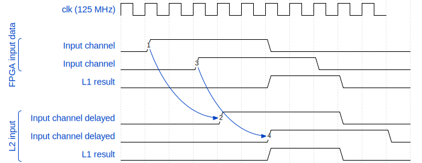
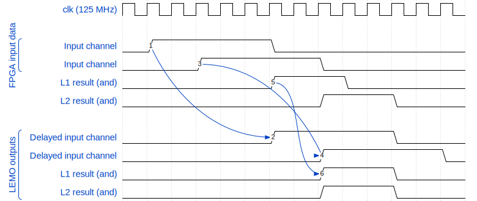

# Latency in data passing through the firmware

Adding fixed latencies to the data path through the FPGA was required to achieve the desired functionality.
In this document, the fixed latencies are described.

**NOTE**: These latencies are independant of the pre-logic delay settings.

## Timing closure

In order to improve timing closure, a latency of one clock tick (8ns) is added to the input data before it is passed into any logic.

## Logic units

Each logic unit adds a delay of two clock ticks on it's result, as demonstrated here:

### L1 Latency

The L1 pathway also has a prescaler applied to reduce the number if triggers if desired.
This adds an additional one clock tick latency to the L1 path.

The full latency between the inputs to L1 and output is 3 clock ticks:

### L2 Latency

Since the L1 results and A & B inputs are both inputs to L2, the A & B inputs are delayed by three clock tick before going into L2:

### LEMO Out Latency

The A & B inputs and the L1 outputs are then delayed an additional two clock ticks in order to align them in time with the L2 outputs.
These final signals are then passed to the LEMO connectors.

## Total latency

Thus, there is a total latency of 6 clock ticks or 6x8 ns = 48 ns between the input and output from the FPGA logic.