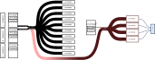

# V1495_firmware

This respository contains firmware for a CAEN V1495 FPGA module.
The V1495 has an Altera Cyclone (first generation) FPGA on it.

## External connectors

The V1495 has three built in connectors and three mezzanine card slots.
These will be used as:
 - Connector A: 32-channel Input
 - Connector B: 32-channel Input
 - Connector C: Unused
 - Mezzanine D: 32-channel Input via A395A mezzanine card
 - Mezzanine E: 8 LEMO outputs via A395D mezzanine card
 - Mezzanine F: 8 LEMO outputs via A395D mezzanine card

## Clocks

In addition to the data ports, there are also two LEMO ports labeled G on the front panel.
In this firmware, G0 shall receive a clock signal with a frequency of 62.5 MHz.
This 62.5 MHz clock is passes through a PLL which produces a 125 MHz clock.
All of the trigger logic is driven by this 125 MHz clock

The register communication is driven by an internal 40 MHz clock on the V1495.

## Latency

The data latency is discussed in detail in the [Latency document](./Latency.md).

## Data flow

### Raw data input

All data input into `A`, `B`, and `D` is counted by 24-bit counters.
Signals in A and B are first sent through a pre-logic treatment, where a delay and gate is applied.
Delays and gates are set via register.

Data input into `D` is only counted, it is not involved in any logic.

### Level 1 logic

The 64 channels after pre-logic treatment are passed to 10 logic units.
Each unit takes in all 64 channels, but only operates on channels which are enabled via register.
The Logic unit `and`s or `or`s the enabled channels together to produce a result.
This result has it's own delay and gate applied, and is then passed on to level 2.

The result of each logic unit is also counted by a 24-bit counter

### Level 2 logic 

There are four level 2 logic units.
Each level 2 logic unit takes in the 64 input channels (after pre-logic) and the delayed and gated level 1 results.
Channels and `L1` outputs can be enabled for `L2` via register..
As with `L1`, `L2` units `and` or `or` the enabled channels together to produce a result.
The result of `L2` has a gate width of one 8 ns clock tick applied

The result of each logic unit is counted by a 24-bit counter.

## LEMO output

The LEMO output can be configured using registers.
Any signal can be routed to the LEMO connectors:
 - `A`, `B`, or `D` raw input
 - `A` or `B` after pre-logic treatment
 - Any `L1` output before and after delay and gate applied
 - Any `L2` output before and after single tick gate applied

The output of LEMO 0 (the bottom-most LEMO connector on the mezzanine card) has a dead time applied.
This deadtime will suppress any signals coming some amount of clock ticks (set via register) coming after a trigger.

## Block diagram

Here is a simplified block diagram:

Note that this leaves out:
 - The register interface
 - Any input signal or logic signal can be routed to the LEMO connectors

## Register access

Register access is discussed in detail in the [registers](Registers.md) document

# Build requirements

[Quartus 13.0.1](https://www.intel.com/content/www/us/en/software-kit/711919/intel-quartus-ii-subscription-edition-design-software-version-13-0sp1-for-linux.html) is required to build this firmware.
Newer versions of Quartus no longer support the first generation Cyclone devices.

A valid license is required to run Quartus.
Information on Quartus licenses at CERN can be found [here](https://engineering-software.docs.cern.ch/eda/sw/intel_quartus_ii/)
